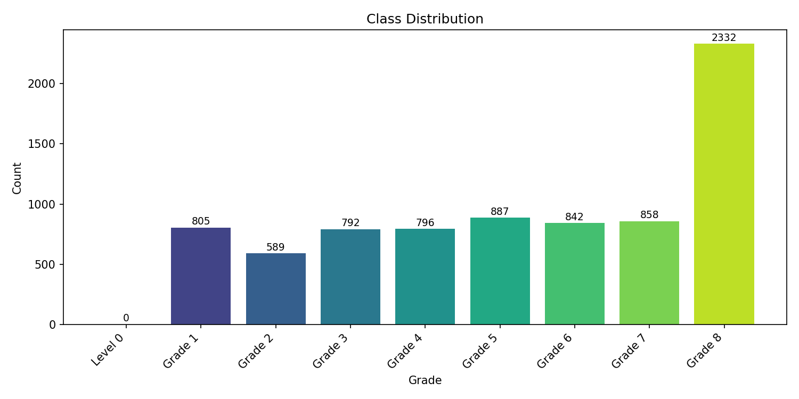
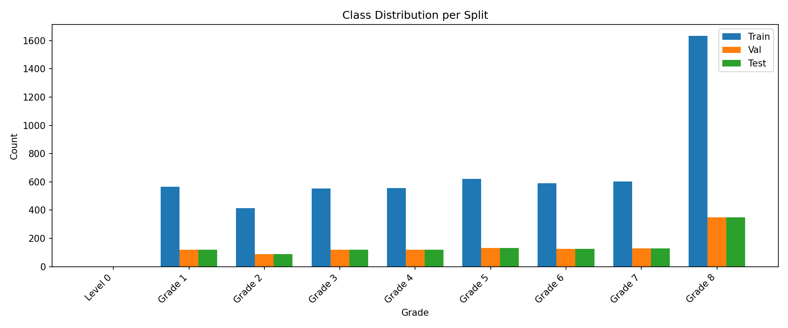
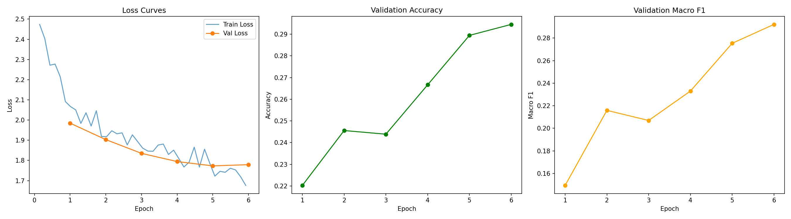
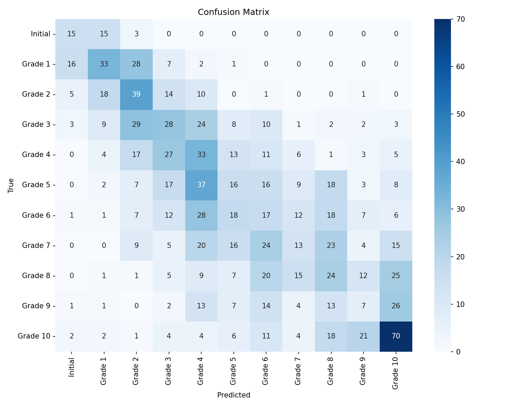
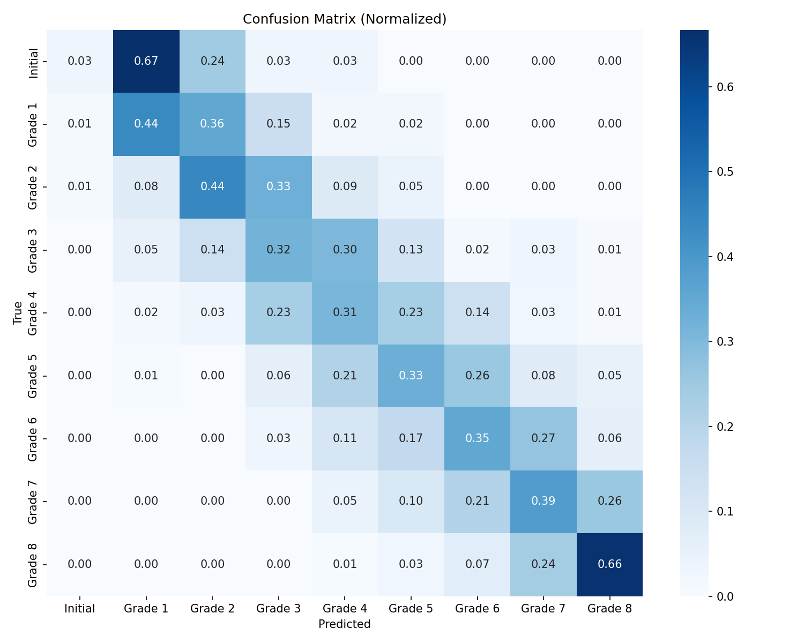
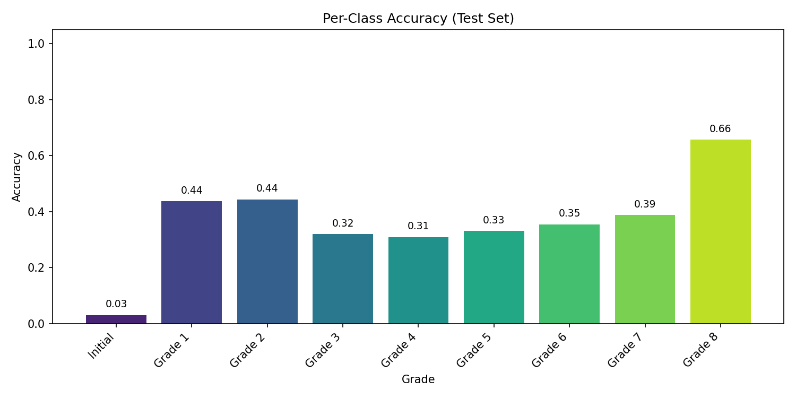
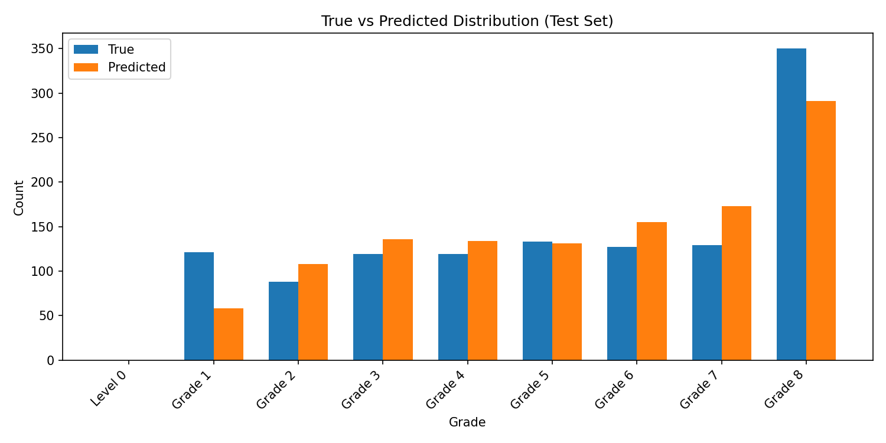

# Piano Syllabus Classifier

Transformer-based classifier that predicts the piano difficulty grade (Initial → Grade 10) from MIDI files, using [MidiTok](https://github.com/Natooz/MidiTok) REMI tokenization and a custom Transformer encoder trained with Hugging Face Trainer.

## Credits

Ramoneda, P., Lee, M., Jeong, D., Valero-Mas, J. J., & Serra, X. (2025). Piano Syllabus Dataset [Data set]. Zenodo. https://doi.org/10.5281/zenodo.14794592

## Requirements

### python deps

```bash
pip install miditok transformers[torch] torch evaluate scikit-learn accelerate seaborn safetensors
```

### dataset deps (see credits)

From: https://zenodo.org/records/14794592
Get data.json from new_clean_data.json 
Get mid.zip and unzip it to get a ./mid/ directory


## Project structure

| File | Description |
|---|---|
| `train_ps_classifier.py` | Main CLI entry point — runs training + test evaluation end-to-end |
| `common.py` | Shared config, label mapping, tokenizer builder, utilities |
| `checks.py` | Data validation, class distribution analysis and plots |
| `model.py` | `MidiClassifier` — Transformer encoder + classification head |
| `training.py` | Dataset creation, collator, HF Trainer setup, training loop |
| `evaluate_model.py` | Test-set evaluation, confusion matrix, per-class report |
| `inference.py` | Predict grade for a new MIDI file |
| `data.json` | Label file mapping piece keys → metadata with `ps` field |
| `mid/` | Directory containing ~7900 piano MIDI files |

## Train

```bash
python train_ps_classifier.py \
    --midi_dir mid \
    --labels_json data.json \
    --output_dir ./ps_model \
    --epochs 10
```

All arguments with defaults:

```
--midi_dir mid              # MIDI files directory
--labels_json data.json     # Label JSON file
--output_dir ./ps_model  # Output directory for model & plots
--epochs 10                 # Training epochs
--batch_size 16             # Batch size
--lr 3e-4                   # Learning rate
--max_seq_len 1024          # Max token sequence length
--d_model 512               # Transformer embedding dimension
--nhead 8                   # Attention heads
--num_layers 8              # Transformer encoder layers
--dim_feedforward 2048      # FFN dimension
--dropout 0.1               # Dropout rate
--seed 42                   # Random seed
--pre_tokenize              # Pre-tokenize all files (faster, more RAM)
```

## Inference

Predict grade for a single MIDI file:

```bash
python inference.py \
    --model_dir ./ps_model \
    --midi_file path/to/piece.mid
```

## Evaluate a saved model

```bash
python evaluate_model.py \
    --model_dir ./ps_model \
    --midi_dir mid \
    --labels_json data.json \
    --output_dir ./eval_results
```

## Output

Training produces these files in `--output_dir`:

- `best_model/` — saved model weights
- `tokenizer.json` — REMI tokenizer config
- `class_distribution.png` — dataset label distribution
- `split_distribution.png` — train/val/test distribution
- `training_curves.png` — loss, accuracy, F1 curves
- `confusion_matrix.png` — test confusion matrix
- `confusion_matrix_normalized.png` — normalized confusion matrix
- `per_class_accuracy.png` — per-grade accuracy bar chart
- `prediction_distribution.png` — true vs predicted distributions
- `test_report.txt` — classification report

## Dataset evaluation

The dataset contains ~7900 MIDI files across 11 grades (Initial → Grade 10). The class distribution is imbalanced — Initial has only 224 samples while Grade 10 has 951.



The data is split into train / validation / test sets with proportional stratification:



## Model evaluation

### Training curves

Loss decreases steadily over 6 epochs. Validation accuracy and macro F1 both improve throughout training, reaching ~29.5% accuracy and ~29% F1 at epoch 6 with no sign of overfitting yet.



### Confusion matrix

The model tends to confuse adjacent grades, which is expected since difficulty is a continuum. Extreme grades (Initial, Grade 1–2, Grade 10) are predicted more reliably than mid-range grades (5–9).





### Per-class accuracy

Best accuracy on Grade 10 (49%) and Initial (45%). Worst on Grade 9 (8%) and Grade 7 (10%). The model struggles most with intermediate-to-advanced grades.



### True vs predicted distribution

The model over-predicts Grade 4 and Grade 2, and under-predicts Grades 5, 7, and 9.



### Test report

```
Overall Accuracy: 24.87%
Macro F1 Score:  24.96%

              precision    recall  f1-score   support

     Initial      0.349     0.455     0.395        33
     Grade 1      0.384     0.379     0.382        87
     Grade 2      0.277     0.443     0.341        88
     Grade 3      0.231     0.235     0.233       119
     Grade 4      0.183     0.275     0.220       120
     Grade 5      0.174     0.120     0.142       133
     Grade 6      0.137     0.134     0.135       127
     Grade 7      0.203     0.101     0.135       129
     Grade 8      0.205     0.202     0.203       119
     Grade 9      0.117     0.080     0.095        88
    Grade 10      0.443     0.490     0.465       143

    accuracy                          0.249      1186
   macro avg      0.246     0.265     0.250      1186
weighted avg      0.239     0.249     0.239      1186
```

### Summary

| Metric | Value |
|---|---|
| Test Accuracy | 24.87% |
| Macro F1 Score | 24.96% |
| Best Validation Accuracy | 29.45% (epoch 6) |
| Final Train Loss | 1.925 |

Performance is low for a practical ABRSM grade classifier, but reasonable as a first attempt with a small custom Transformer (~2.2M parameters, 4 layers). The model captures the ordinal structure (confusions cluster near the diagonal) and clearly separates extreme grades from each other.


