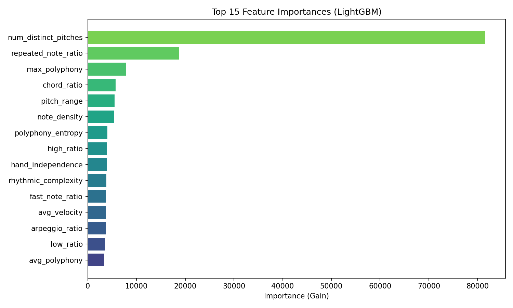

# Piano Syllabus Classifier

Feature-extraction-based ensemble that predicts the piano difficulty grade (1 → Grade 8+) from MIDI files, using 18 handcrafted musicological features, a configurable MLP trained with CORN (Conditional Ordinal Regression Network) loss via Hugging Face Trainer, and a LightGBM regressor combined through weighted averaging.


## Results


### Model evaluation

- MAE (continuous): 0.7920
- Accuracy (rounded): 46.96%
- Macro F1 (rounded): 42.21%

|              | precision | recall | f1-score | support |
|--------------|-----------|--------|----------|---------|
| Grade 1      | 0.897     | 0.430  | 0.581    | 121     |
| Grade 2      | 0.333     | 0.409  | 0.367    | 88      |
| Grade 3      | 0.331     | 0.378  | 0.353    | 119     |
| Grade 4      | 0.306     | 0.345  | 0.324    | 119     |
| Grade 5      | 0.328     | 0.323  | 0.326    | 133     |
| Grade 6      | 0.297     | 0.362  | 0.326    | 127     |
| Grade 7      | 0.301     | 0.403  | 0.344    | 129     |
| Grade 8      | 0.832     | 0.691  | 0.755    | 350     |
|              |           |        |          |         |
| accuracy     |           |        | 0.470    | 1186    |
| macro avg    | 0.453     | 0.418  | 0.422    | 1186    |
| weighted avg | 0.527     | 0.470  | 0.486    | 1186    |


On a scale of 1–10 for this specific problem (low-dimensional tabular + ordinal + imbalanced + noisy boundaries):6.5 / 10 — Decent / Good practical model.
It is well above random and clearly better.
It is not yet excellent (excellent would be MAE < 0.70, accuracy > 52–55%, macro F1 > 0.48–0.50).
In real-world ordinal grading tasks (e.g., student ratings, medical severity scores, product quality levels), this level of performance is common and often usable, especially if off-by-1 errors are tolerable.


#### Training curves

Loss decreases sharply over the first 3 epochs then plateaus. Validation accuracy (rounded) reaches ~43.9% at epoch 12 with some oscillation in the 35–43% range. Validation MAE drops from 3.35 to ~0.89, showing the regression output converges well.


#### Confusion matrix

The ensemble confuses mainly adjacent grades, which is expected for an ordinal scale. Grade 8 (merged 8–10) is the best-predicted class with 230 correct out of 350. Lower grades (Initial, Grade 1–2) are confused with their immediate neighbours. Mid-range grades (3–5) show more spread.


#### Per-class accuracy

Best accuracy on Grade 8 (66%) and Grade 1/Grade 2 (44% each). Worst on Initial (3%), likely due to its very small sample size (33 test samples) and the model confusing it with Grade 1. Mid-range grades (3–6) hover around 31–35%.


#### True vs predicted distribution

The model under-predicts Initial (almost never predicted) and Grade 8 (280 predicted vs 350 true). It slightly over-predicts Grades 2, 6, and 7. Overall the predicted distribution tracks the true distribution reasonably well for mid-range grades.


#### Feature importance (LightGBM)

`num_distinct_pitches` dominates by a wide margin, followed by `repeated_note_ratio` and `max_polyphony`. Texture and complexity features (chord ratio, pitch range, note density) also contribute significantly. `wide_leap_ratio` has negligible importance.




 
## Dataset deps (see credits)

### Dataset evaluation

The dataset contains ~7900 MIDI files across 9 grades (Initial → Grade 8, with original Grades 9–10 merged into Grade 8). The class distribution is imbalanced — Initial has only 224 samples while Grade 8 (merged) has 2332.


The data is split into train / validation / test sets with proportional stratification:


From: https://zenodo.org/records/14794592
Get data.json from new_clean_data.json 
Get mid.zip and unzip it to get a ./mid/ directory


## Requirements

```bash
pip install symusic torch transformers[torch] scikit-learn lightgbm matplotlib seaborn numpy safetensors
```

## Project structure

| File | Description |
|---|---|
| `train_ps_classifier.py` | Main CLI entry point — runs training + test evaluation end-to-end |
| `common.py` | Shared config, label mapping, utilities |
| `checks.py` | Data validation, class distribution analysis and plots |
| `features.py` | Handcrafted musicological feature extraction (18 features) |
| `model.py` | `FeatureMLPRegressor` — 3-layer MLP + `EnsembleRegressor` (MLP + LightGBM) |
| `ensemble.py` | 5-fold stacking ensemble & feature importance analysis |
| `training.py` | Dataset creation, HF Trainer setup, training loop |
| `evaluate_model.py` | Test-set evaluation, confusion matrix, per-class report |
| `inference.py` | Predict grade for a new MIDI file |
| `postprocess.py` | Post-processing utilities (isotonic regression, calibration) |
| `data.json` | Label file mapping piece keys → metadata with `ps` field |
| `mid/` | Directory containing ~7900 piano MIDI files |

## Train

```bash
python train_ps_classifier.py \
    --midi_dir mid \
    --labels_json data.json \
    --output_dir ./ps_model \
    --epochs 12
```

All arguments with defaults (from `DEFAULT_HPARAMS` in `common.py`):

```
# Data & output
--midi_dir mid                        # MIDI files directory
--labels_json data.json               # Label JSON file
--output_dir ./ps_model               # Output directory for model & plots

# Training
--epochs 100                          # Training epochs
--batch_size 64                       # Batch size
--lr 5e-4                             # Learning rate
--dropout 0.3                         # Dropout rate
--seed 42                             # Random seed
--dataloader_num_workers 4            # DataLoader workers (0 saves RAM)
--gradient_accumulation_steps 1       # Accumulate gradients (use with smaller batch_size)
```

Additional parameters configured in `DEFAULT_HPARAMS` (not exposed as CLI args):

```python
# MLP architecture
hidden_dim = 64
num_hidden_layers = 2
use_batch_norm = True
activation = "relu"

# Optimiser
optimizer = "adamw"
weight_decay = 1e-5
warmup_ratio = 0.1

# CORN task weights (inverse-frequency, mean-normalised)
corn_task_weights = [0.85, 0.85, 0.92, 0.98, 1.05, 1.18, 1.35, 1.62]

# Scheduler & early stopping
scheduler = "cosine"
early_stopping_patience = 20
```

## Inference

Predict grade for a single MIDI file:

```bash
python inference.py \
    --model_dir ./ps_model \
    --midi_file path/to/piece.mid
```

## Evaluate a saved model

```bash
python evaluate_model.py \
    --model_dir ./ps_model \
    --midi_dir mid \
    --labels_json data.json \
    --output_dir ./eval_results
```

## Output

Training produces these files in `--output_dir`:

- `best_model/` — saved MLP model weights
- `lgbm_model.txt` — LightGBM model
- `feature_normalizer.npz` — feature normalizer (mean/std)
- `config.json` — model and training configuration
- `feature_importance.json` — LightGBM feature importances
- `class_distribution.png` — dataset label distribution
- `split_distribution.png` — train/val/test distribution
- `training_curves.png` — loss, accuracy, MAE curves
- `confusion_matrix.png` — test confusion matrix
- `confusion_matrix_normalized.png` — normalized confusion matrix
- `per_class_accuracy.png` — per-grade accuracy bar chart
- `prediction_distribution.png` — true vs predicted distributions
- `feature_importance.png` — LightGBM feature importance plot
- `test_report.txt` — classification report

## Credits

Thanks to Ramoneda, P., Lee, M., Jeong, D., Valero-Mas, J. J., & Serra, X. (2025). Piano Syllabus Dataset [Data set]. Zenodo. https://doi.org/10.5281/zenodo.14794592 for providing very welcome dataset.
